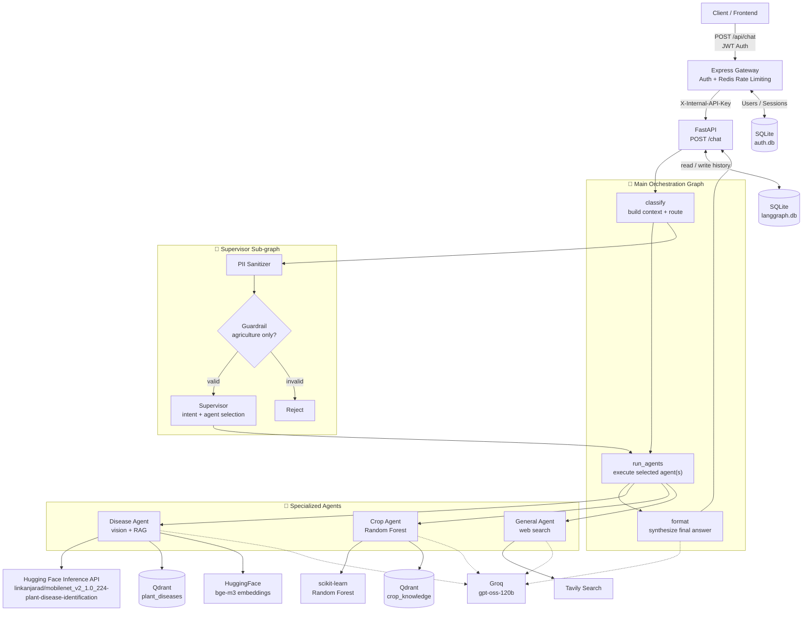
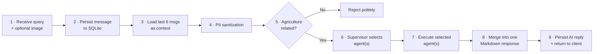

<div align="center">

# 🌾 Smart Agriculture Multi-Agent Backend

**An AI-powered farming assistant that diagnoses plant diseases, recommends crops, and answers live agronomic questions — orchestrated by a LangGraph supervisor over specialized sub-agents.**


</div>

---

## 📖 Overview

The Smart Agriculture Backend is a production-oriented API that acts as a single conversational entry point for a range of farming tasks. Behind one `/chat` endpoint, a **Supervisor agent** interprets each request, enforces safety and privacy guardrails, and dispatches it to one or more **specialized agents**:

- a **Disease Agent** that classifies a plant disease from an uploaded leaf image and explains it using a Retrieval-Augmented Generation (RAG) knowledge base,
- a **Crop Agent** that recommends an optimal crop from soil and weather parameters using a trained Random Forest model, and
- a **General Agent** that answers open-ended farming questions with live web search.

Conversations are **session-scoped and persistent**, so a farmer can upload an image once and then ask natural follow-up questions ("What's the best chemical control for it?") without re-stating context.

## 📑 Table of Contents

- [Key Features](#-key-features)
- [Architecture](#️-architecture)
- [Request Lifecycle](#-request-lifecycle-working-flow)
- [Session Memory Model](#-session-memory-model)
- [Tech Stack](#️-tech-stack)
- [Project Structure](#-project-structure)
- [Prerequisites](#-prerequisites)
- [Getting Started](#-getting-started)
- [Configuration](#-configuration)
- [Running the Application](#️-running-the-application)
- [API Reference](#-api-reference)
- [Testing](#-testing)
- [Roadmap](#️-roadmap)
- [License](#-license)

---

## ✨ Key Features

- **🧭 Multi-Agent Orchestration** — A central Supervisor classifies intent (`disease`, `crop`, `general`, or `multi_domain`) and selects the right specialist(s). Multi-domain queries fan out to several agents, whose answers are synthesized into one cohesive reply.
- **🖼️ Disease Agent V2 (Vision + Intent-Driven RAG)** — Intercepts uploaded images via an ML classification service, maps the prediction, and uses a highly optimized **Qdrant** vector pipeline. V2 features semantic section-chunking, rich metadata payload indexing, and an LLM intent classifier to extract exact answers (symptoms, causes, organic/chemical control) with confidence-aware retrieval fallbacks.
- **🌱 Crop Recommendation Agent** — Extracts agronomic parameters (N, P, K, temperature, humidity, pH, rainfall) from natural language, runs a local **scikit-learn Random Forest** model, and explains *why* the recommended crop fits.
- **🔎 General Agent (Live Web Search)** — Uses **Tavily** to retrieve up-to-date information (market prices, best practices, sustainability) and answers strictly from the gathered evidence.
- **🧠 Session-Scoped Memory** — SQLite checkpointers persist every conversation turn per `session_id`, with structured results (last disease, last crop) carried forward so follow-ups work without re-uploading images.
- **🛡️ Guardrails** — Built-in **PII sanitization** (names, emails, phones, locations → `[REDACTED]`) and a **domain guardrail** that politely rejects non-agriculture queries.
- **♻️ Resilience** — Exponential-backoff retry logic wraps LLM calls to absorb transient upstream errors (rate limits, 5xx, tool-choice hiccups).
- **📊 Observability** — Optional end-to-end tracing via **LangSmith**.

---

## 🏗️ Architecture

The system uses an **Express.js API Gateway** for authentication, authorization, and rate limiting, which proxies requests to a **FastAPI backend** running a **graph of graphs**. The top-level orchestration graph owns persistence and response synthesis; it delegates routing to a Supervisor sub-graph and execution to three self-contained agent sub-graphs.



### Component responsibilities

| Layer | Module | Responsibility |
|-------|--------|----------------|
| **Gateway** | `gateway/` | Express.js API gateway. Handles JWT auth, session authorization, and Redis rate-limiting. |
| **API** | `main.py`, `api/routes.py` | FastAPI app, protected internal endpoints, lifespan wiring. |
| **Orchestration** | `graph/main_graph.py` | `classify → run_agents → format`; builds context, dispatches agents, merges responses. |
| **Routing** | `agents/supervisor/graph.py` | `PII sanitizer → guardrail → supervisor/reject`; intent classification & agent selection. |
| **Disease** | `agents/disease/*` | V2 RAG Pipeline: `ingest.py`, `normalizer.py`, `chunker.py`, intent classifier, and V2 Retriever with semantic fallback. |
| **Crop** | `agents/crop/*`, `services/crop_model.py` | `validate → predict → retrieve → build context → reason` (Random Forest + RAG). |
| **General** | `agents/general/graph.py` | `validate → search → process evidence → reason` (Tavily-grounded). |
| **State & Memory** | `graph/state.py`, `graph/persistence.py` | Typed `TypedDict` states and the SQLite checkpointer factory. |
| **Config** | `config/settings.py` | `pydantic-settings`-based configuration from environment. |


---

## 🔄 Request Lifecycle (Working Flow)

Every call to `/chat` flows through the pipeline below. Think of it as a receptionist (Supervisor) who screens the request, then hands it to the right specialists and stitches their answers together.



1. **Receive** — The endpoint accepts `query`, `session_id`, and an optional image `file` (saved to a temp path, deleted after the request).
2. **Persist & load context** — The user message is checkpointed, and the last 6 messages (3 turns) are loaded as rolling context.
3. **Sanitize** — PII is scrubbed before anything is sent to external LLMs.
4. **Guardrail** — Non-agriculture queries are rejected. *An attached image or an existing conversation automatically passes the guardrail.*
5. **Route** — The Supervisor picks `disease_agent`, `crop_agent`, `general_agent`, or a combination.
6. **Execute** — Each selected agent runs its own sub-graph. Structured outcomes (detected disease, recommended crop) are saved into session state.
7. **Synthesize** — A single agent's answer is returned directly; multiple answers are merged by the LLM into one clean Markdown reply.
8. **Return** — The AI reply is checkpointed and sent back as JSON.

---

## 🧠 Session Memory Model

Memory balances completeness with the practical limits of an LLM context window.

| Layer | Where it lives | Persists across restarts? |
|-------|----------------|:-------------------------:|
| Full message history | `storage/checkpoints/langgraph.db` (SQLite) | ✅ |
| Active context (rolling window) | Rebuilt per request from the last **6 messages** | ❌ (recomputed) |
| Last disease result (prediction, disease id, crop) | SQLite checkpoint state | ✅ |
| Last crop result (recommended crop, features) | SQLite checkpoint state | ✅ |

**Everything is stored; only the most recent ~3 turns are actively reasoned over.** This keeps requests fast, cheap, and safely under the model's context limit. Because the last disease/crop results are stored as structured state, the Disease Agent can answer follow-ups (e.g. "what's the chemical control for it?") **without a new image upload**. Memory is strictly isolated per `session_id`.

> See [`Working.md`](./Working.md) for a deeper, plain-English explanation of the memory design and its trade-offs.

---

## 🛠️ Tech Stack

| Category | Technology |
|----------|-----------|
| **Language** | Python 3.13 |
| **Packaging / Env** | [`uv`](https://docs.astral.sh/uv/) (with `pyproject.toml` + `uv.lock`) |
| **API Framework** | FastAPI + Uvicorn (ASGI) |
| **Agent Orchestration** | LangGraph · LangChain · `langgraph-checkpoint-sqlite` |
| **LLM Provider** | Groq — `openai/gpt-oss-120b` |
| **Embeddings** | HuggingFace Inference API — `BAAI/bge-m3` |
| **Vector Database** | Qdrant (collections: `disease_knowledge_v2`, `crop_knowledge`) |
| **Classical ML** | scikit-learn (Random Forest) · joblib · pandas |
| **Web Search** | Tavily |
| **Session Persistence** | SQLite via `AsyncSqliteSaver` (`aiosqlite`) |
| **Config & Validation** | `pydantic-settings` · `python-dotenv` |
| **HTTP Client** | `httpx` & `huggingface_hub` |
| **Observability** | LangSmith (optional) |
| **Disease Classification** | Hugging Face Inference API (`mobilenet_v2`) |

---

## 📁 Project Structure

```
agent_backend/
├── main.py                     # FastAPI app + lifespan (checkpointer & graph wiring)
├── pyproject.toml              # Dependencies (managed by uv)
├── uv.lock                     # Locked dependency versions
├── api/
│   └── routes.py               # POST /chat endpoint
├── graph/
│   ├── main_graph.py           # Main orchestration graph (classify → run → format)
│   ├── state.py                # Typed state definitions (TypedDict)
│   └── persistence.py          # SQLite checkpointer factory
├── agents/
│   ├── supervisor/graph.py     # PII → guardrail → routing
│   ├── disease/                # Disease agent: graph, classifier, retriever, mapper
│   ├── crop/                   # Crop agent: graph, retriever
│   ├── general/graph.py        # General agent (Tavily-grounded)
│   ├── response/graph.py       # Response synthesis node
│   ├── notebooks/              # Prototyping notebooks
│   ├── docker-compose.yml      # Qdrant service definition
│   ├── models/                 # Random Forest model + encoder (.pkl)   ‹not tracked›
│   └── diseases/               # Disease knowledge base (.json)          ‹not tracked›
├── services/
│   ├── crop_model.py           # Random Forest feature prep + inference
│   └── disease_api.py          # Client for the external disease ML API
├── schemas/                    # Pydantic request/response models
├── config/
│   └── settings.py             # pydantic-settings configuration
├── assets/                     # Sample images (e.g. AppleScab1.JPG)
├── storage/                    # SQLite checkpoints                       ‹not tracked›
├── Working.md                  # Memory model documentation
└── Testing.md                  # Manual API testing guide
```

> **Note:** `agents/models/`, `agents/diseases/`, `storage/`, and Qdrant data are `.gitignore`d. You must supply the trained model artifacts and knowledge base, and seed the Qdrant collections, before disease/crop features work end-to-end (see [Prerequisites](#-prerequisites)).

---

## ✅ Prerequisites

Before running the backend, make sure you have:

- **Python 3.13** and the **[`uv`](https://docs.astral.sh/uv/)** package manager
- **Docker** (to run Qdrant), or access to an existing Qdrant instance
- **API keys**: [Groq](https://console.groq.com/), [HuggingFace](https://huggingface.co/settings/tokens) (for embeddings), and [Tavily](https://tavily.com/)
- A valid Hugging Face Token (`HF_TOKEN`) for the disease classification model.
- **Data & model assets** (not included in the repo):
  - `agents/models/crop_recommendation_rf_model.pkl` and `agents/models/target_encoder.pkl`
  - Disease knowledge JSON files under `agents/diseases/`
  - Seeded Qdrant collections: `disease_knowledge_v2` and `crop_knowledge`

---

## 🚀 Getting Started

### 1. Clone the repository

```bash
git clone <your-repo-url>
cd agent_backend
```

### 2. Install dependencies

`uv` reads `pyproject.toml` + `uv.lock` and creates an isolated environment automatically:

```bash
uv sync
```

<sub>To use the environment directly: activate it with <code>.venv\Scripts\activate</code> (Windows) or <code>source .venv/bin/activate</code> (macOS/Linux). Prefixing commands with <code>uv run</code> works without activation.</sub>

### 3. Start Qdrant (vector database)

```bash
docker compose -f agents/docker-compose.yml up -d
```

Qdrant will be available at `http://localhost:6333`.

### 4. Provide model & knowledge assets

Place the Random Forest artifacts in `agents/models/`, the disease JSON files in `agents/diseases/`, and seed the `plant_diseases` and `crop_knowledge` Qdrant collections.

### 5. Start the Application

The disease detection uses the remote Hugging Face Inference API, so you do not need to run a local model server. Just ensure `HF_TOKEN` is set.

### 6. Configure environment variables

Create a `.env` file in the project root — see [Configuration](#-configuration).

---

## 🔧 Configuration

Create a `.env` file in the project root. Values are loaded via `pydantic-settings`.

```env
# ── Required ─────────────────────────────────────────────
GROQ_API_KEY=your_groq_api_key          # LLM (gpt-oss-120b)
HF_TOKEN=your_huggingface_token         # bge-m3 embeddings
TAVILY_API_KEY=your_tavily_api_key      # web search

# ── External services (defaults shown) ───────────────────
QDRANT_URL=http://localhost:6333
HF_TOKEN=your_huggingface_token
HF_DISEASE_MODEL=linkanjarad/mobilenet_v2_1.0_224-plant-disease-identification

# ── Session memory (defaults shown) ──────────────────────
SESSION_CHECKPOINTER_BACKEND=sqlite
SESSION_CHECKPOINT_DB_PATH=./storage/checkpoints/langgraph.db
MAX_CONVERSATION_MESSAGES=20

# ── Optional ─────────────────────────────────────────────
GOOGLE_API_KEY=your_google_api_key      # optional alternate LLM provider

# ── Observability (optional, LangSmith) ──────────────────
LANGSMITH_TRACING=true
LANGSMITH_API_KEY=your_langsmith_api_key
LANGSMITH_PROJECT=smart-agriculture
```

| Variable | Required | Default | Description |
|----------|:--------:|---------|-------------|
| `GROQ_API_KEY` | ✅ | — | Groq API key for the `gpt-oss-120b` model. |
| `HF_TOKEN` | ✅ | — | HuggingFace token for `bge-m3` embeddings. |
| `TAVILY_API_KEY` | ✅ | — | Tavily key for the General Agent's web search. |
| `QDRANT_URL` | — | `http://localhost:6333` | Qdrant endpoint. |
| `HF_TOKEN` | — | `None` | Your Hugging Face API token for remote disease inference. |
| `HF_DISEASE_MODEL` | — | `linkanjarad/mobilenet_v2...` | The Hugging Face repo ID for disease classification. |
| `SESSION_CHECKPOINTER_BACKEND` | — | `sqlite` | Memory backend (SQLite today; pluggable). |
| `SESSION_CHECKPOINT_DB_PATH` | — | `./storage/checkpoints/langgraph.db` | SQLite checkpoint file path. |
| `MAX_CONVERSATION_MESSAGES` | — | `20` | Upper bound for retained conversation messages. |
| `GOOGLE_API_KEY` | — | — | Optional Google GenAI key. |
| `LANGSMITH_TRACING` / `LANGSMITH_API_KEY` / `LANGSMITH_PROJECT` | — | — | Optional LangSmith tracing. |

---

## ▶️ Running the Application

Start the FastAPI server with Uvicorn:

```bash
uv run uvicorn main:app --host 0.0.0.0 --port 8001
```

Or simply run the module (it starts Uvicorn with hot-reload):

```bash
uv run main.py
```

Once running:

| Resource | URL |
|----------|-----|
| Chat endpoint | `http://127.0.0.1:8001/chat` |
| Health check | `http://127.0.0.1:8001/health` |
| Swagger UI | `http://127.0.0.1:8001/docs` |

---

## 📡 API Reference

### `GET /health`

Returns service and memory status.

```json
{
  "status": "ok",
  "message": "Smart Agriculture Backend is healthy",
  "memory": "available"
}
```

### `POST /chat`

Accepts `multipart/form-data`.

| Field | Type | Required | Description |
|-------|------|:--------:|-------------|
| `query` | string | ✅ | The user's question. |
| `session_id` | string | ✅ | Conversation id (≤ 255 chars) used for memory. |
| `file` | file (image) | — | Optional leaf/plant image for disease detection. |

**Response**

```json
{
  "status": "success",
  "query": "What disease is this?",
  "response": "## Diagnosis\n...markdown answer...",
  "session_id": "test-session-123"
}
```

**Example — image-based disease detection**

```bash
curl -X POST http://127.0.0.1:8001/chat \
  -F "query=What disease is this?" \
  -F "session_id=test-session-123" \
  -F "file=@assets/AppleScab1.JPG"
```

**Example — crop recommendation (text only)**

```bash
curl -X POST http://127.0.0.1:8001/chat \
  -F "query=Recommend a crop for N=40 P=50 K=50 temperature=28 humidity=75 ph=6.5 rainfall=200" \
  -F "session_id=test-session-123"
```

**Example — follow-up (no image, uses memory)**

```bash
curl -X POST http://127.0.0.1:8001/chat \
  -F "query=What is the best chemical control for it?" \
  -F "session_id=test-session-123"
```

---

## 🧪 Testing

The [`Testing.md`](./Testing.md) guide walks through manual verification scenarios, including:

- Health check
- Disease follow-ups that reuse memory (no re-upload)
- Crop recommendation from parameters
- Multi-agent routing (e.g. market price + crop recommendation)
- Guardrail rejection of off-topic queries
- Cross-session isolation
- Persistence across server restarts

A sample image is provided at [`assets/AppleScab1.JPG`](./assets/AppleScab1.JPG) for quick testing.

---

## 🗺️ Roadmap

The architecture is designed so these enhancements can be added without a redesign:

- **Configurable context window** — expose the rolling-window size (currently the last 6 messages) as a setting.
- **Long-term semantic memory** — periodically summarize a session and prepend the summary to future context.
- **Pinned entity memory** — always-available structured facts (already seeded by the stored `disease_result` / `crop_result`).
- **PostgreSQL checkpointer** — `graph/persistence.py` is a factory built to accept additional backends beyond SQLite.

---

<div align="center">
<sub>Built with FastAPI · LangGraph · Groq · Qdrant · scikit-learn</sub>
</div>
