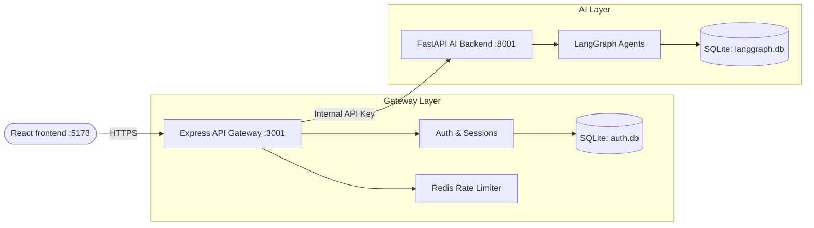

# Smart Agriculture Multi-Agent Backend - API Gateway

This directory contains the **Express.js API Gateway** for the Smart Agriculture Multi-Agent Backend system. 

The Gateway serves as the public-facing entry point to the system, acting as a secure proxy and authentication layer in front of the internal LangGraph AI backend.

## 🚀 Key Features

* **Authentication & Authorization**: Full JWT-based authentication flow (Register, Login, Logout) with short-lived access tokens and secure, hashed refresh tokens.
* **Session Management**: Chat sessions are bound to users. The Gateway ensures users can only access and modify their own chat histories.
* **Intelligent Rate Limiting**: Redis-backed rate limiting per IP and per User+IP to protect against abuse and DDoS attacks. Includes fail-safe mechanisms if Redis goes down.
* **Proxying**: Securely proxies authenticated chat requests to the internal FastAPI server using an internal API secret, ensuring the AI service cannot be accessed directly from the outside.
* **Input Validation**: Strict request payload validation using Zod schemas.

## 🛠 Tech Stack

* **Runtime**: Node.js
* **Framework**: Express.js
* **Database**: SQLite (via Prisma ORM)
* **Caching/Rate Limiting**: Redis
* **Security**: Helmet, CORS, Argon2 (Password Hashing), JSON Web Tokens (JWT)
* **Validation**: Zod

## 🏗 Architecture



## ⚙️ Environment Variables

Create a `.env` file in this directory with the following variables:

```env
# Server Configuration
NODE_ENV=development
PORT=3001
FRONTEND_ORIGIN=http://localhost:5173

# Database Configuration (Relative to prisma folder)
DATABASE_URL="file:../../agent_backend/storage/auth/auth.db"

# JWT Configuration
JWT_SECRET=your_super_secret_jwt_key_here
JWT_EXPIRES_IN=15m
REFRESH_TOKEN_SECRET=your_super_secret_refresh_key_here
REFRESH_TOKEN_EXPIRES_IN=7d

# Internal API Authentication
INTERNAL_API_SECRET=super_secret_internal_key

# Redis Configuration (Rate Limiting)
REDIS_URL=redis://127.0.0.1:6379
```

## 🚀 Getting Started

### 1. Install Dependencies
```bash
npm install
```

### 2. Setup the Database
Push the Prisma schema to create the SQLite database tables:
```bash
npx prisma db push
```

### 3. Start the Server
Start the development server using nodemon:
```bash
npm run dev
```
For production:
```bash
npm start
```

## 📖 API Documentation

### Auth Routes (`/api/auth`)
* `POST /register`: Register a new user (`email`, `password`)
* `POST /login`: Authenticate and receive tokens
* `POST /refresh`: Issue a new access token using a refresh token
* `POST /logout`: Revoke tokens and logout
* `GET /me`: Get current authenticated user details

### Session Routes (`/api/sessions`)
* `GET /`: Retrieve all chat sessions for the logged-in user
* `POST /`: Create a new chat session (`title`)
* `GET /:id`: Get details for a specific session
* `PATCH /:id`: Rename a chat session (`title`)
* `DELETE /:id`: Delete a chat session

### Chat Routes (`/api/chat`)
* `POST /`: Send a query (and optional image file) to the AI assistant. Proxies the request to the LangGraph backend.
* `GET /:session_id`: Fetch the historical chat messages for a given session.

### Health Routes
* `GET /health`: Check gateway process health.
* `GET /health/ready`: Check gateway readiness.
